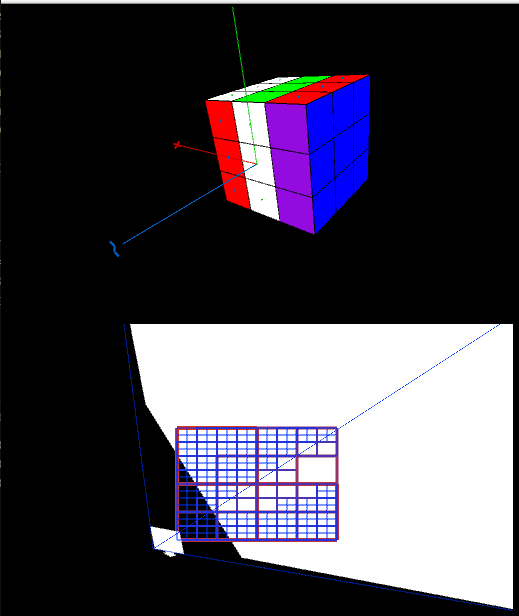

# Taller de interacción

## Propósito

Estudiar y aplicar conceptos de interacción vistos en clase

## Integrantes

| Integrante | github nick |
|------------|-------------|
|Raul Ramirez| [raulramirezp](https://github.com/raulramirezp)             |

## Objetivos

Realizar un cubo de rubik con el cual se pueda interactuar por medio del teclado y crear 3 vistas de perspectiva
del mismo. 

## Descripción
Para la realización del cubo se usaron Frames, y se creó la siguiente jerarquía del gráfico de la escena:
``` 
         - - Word - - 
        /      |      \
    frame1  frame2  frame3
   (frame4) (frame5) (frame6)
    /          |         \
0...8       9...17    18...26
frames      frames     frames
``` 

Donde cada frame representa un cubo de los que los 27 que componen el Rubik, 

La idea general es que cada Frame está asociado a un frame que contiene 9 de estos de tal manera que cuando se realice un giro del cubo se haga una traslación sólo al frame padre. Estos frames debe asignarse dinámicamente a alguno de los 6 frames principales, de tal forma que se puedan realizar los movimientos del cubo correctamente.

## Resultados

El resultado es el siguiente:



Aún no se a completado la funcionalidad,por problemas de implementación, no se pueden realizar los movimientos completos del cubo ya que las asociaciones dinámicas de los frames hijos a diferentes frames padres no se han podido lograr hasta el momento

Las escenas que mostrarían las perspectivas del cubo aún no se han completado dado que se requiere primero la correcta funcionalidad del paso anterior para completar este.

## Trabajo a futuro

Dado que cuando se complete esta versión, solo se podría interactuar con el teclado, se quiere que la interacción se a más alto nivel por medio del uso de una cámara web de tal manera que se pueda jugar con el cubo de Rubik tan solo mirando la pantalla y haciendo movimientos con las manos que indiquen que rotación de quiere realizar.
## Referencias

La documentación de la librería  [frames](https://github.com/VisualComputing/framesjs)


